PureHealth Gym

## 1. UX

### Project Goals

#### Project purpose 

The purpose of this project is to create a website that helps provide important information that the local gym offers. Having a gym website allows clients to engage with gym services online which makes it more accessible for users. Having the information on the website also allows potential members that want to know more information before paying for a membership. The design and features on the website will hopefully attract customers to the gym. It makes it easier for users to find what they want to instead of ringing up or visiting the gym which is why navigating the website is quicker.

#### **User goals** ####

Allows clients or potential clients to view information about the gym on the web. This allows users to find information such as membership types, scheduling, location and etc. Users can pay for a membership from one of the options presented to them on the website. Paying online saves travel cost of traveling to the gym directly to pay.

Different users will be looking for the same or different goals when visiting the website. The most important information on the page will be at the top so users can see it first when navigating. The website will help inspire and motivate users to join the gym and to start or continue their fitness journey. Having a website that is easy to use will help older demographics who might have less experience on the internet. It targets any demographic because health and fitness is important to all demographics. Users will start on the index.html which is the homepage, from there they can navigate around the website and can go onto other pages such as contact.html which dedicates the entire page with the information they are looking for.

#### **Site owner goals** ####

The goal is to promote health and fitness and help people improve their physical and mental health by helping users join the gym for the locals. 

As a result of this goal, we will provide a website that looks visually appealing and easy navigation to catch the users eye. Doing this will help the user to understand the benefits of joining the gym and learning information about it.

## User stories

### User 

**User story 1: As a gym member I would like to:**

* Find out what times classes are on.
* Book a personal training session.
* Follow for updates on social media.

**User story 2: As a potenial member I would like to:**

* Look for a variety of membership types.
* See photos of the gym and the enviroment.
* Contact the gym for more information.
* Find the location.
* See what the gym offers.

### Research

**Reviewing other gym websites**

I looked at other well known gym websites to see what features their site others and how their design is. I added features that I thought would be good for my website such as a hero image which mostly every website I came across had. All these websites were very eye catching when viewing them with amazing design.

**Websites I visited**
* [AnytimeFitness](https://www.anytimefitness.co.uk/) 
* [Everlast gyms](https://www.everlastgyms.com/) 
* [Pumpgyms](https://www.pumpgyms.com/watfordtolpitslane/) 

## 2. Design

### Wireframes

I used Balsamiq Wireframes to help structure the wireframes before and during the design of the website. This helped me plan the design of the website by helping me apply the layout and the navigation. Using the software is good for designing layouts on different devices so that I can implement them later on.

 

 Mobile 

 

 Tablet 

 

 Desktop 

### Website Structure

The website is made to be a simple structure that enables users to easily navigate around. I wanted the user to find the information they wanted to with the least amount of clicks. 
The most important information will be at the top of the page so that the user sees it first.

The site has a structure of 5 pages and 2 sub pages:

- Homepage - This is the first page the users will see and the page is about what the gym offers, location with interative map and gym opening times.

- Membership - This webpage can be clicked from the navbar link or membership card on the homepage. This page gives information on the membership types.

- Contact - This page can be clicked from the navbar link or personal training card on the homepage. This page allows the user to contact the gym with email or phone.
    - Success page - This page is for the contact page when you complete the form. The page tells the user that their form has been sent through.

- Gallery - This page can be clicked from the navbar link or facility card on the homepage. This page is where images of the gym are stored.

- Classes - This page can be clicked on from the navbar or the classes card on the homepage. Gives the user more information on classes.

### Colours

For my colours, I wanted the main colours to be purple but decided that it would better and easier to see the text with a type of dark gray. For my secondary colour I chose a lighter gray which goes well with my main colour. Both colours makes it easier to see white text so that the text doesn't blend in with the background. For my accent colours I decided to make that a purple colour which was orignally going to be my main colour. The purple makes interactive features stand out such as buttons and links. Hovering effect will be a a darker shade of purple with white text.

 
### Fonts

For my fonts I imported fonts from Google fonts. I used the font Bungee for headings because this font makes it stand out and clear to read. For the body text I decided to use Markazi and for navbar links I used system-ui, -apple-system.

## 3. Technologies

### Languages used in this project

* HTML - The main language I use for this website is HTML which is the foundation and the structure of the website.

* CSS - This language I also mainly used to style my html elements to make them look more visually appealing to users that navigate the website.

### Tools used in the project

* [Bootstrap](https://getbootstrap.com/) 
  - I used Bootstrap to make responsive layouts which help on adapt to different screen sizes.

* [Google Fonts](https://fonts.google.com/) 
  - Google fonts helps me to customise texts making them suitable for my website. They provide me with more options for font customization.
  
* [Balsamiq Wireframes](https://balsamiq.com/) 
  - Used to create wireframes to help plan the structure of my website.

* [GitHub](https://github.com/) 
   - I use GitHub to store source code as well as keeping track on tasks.

* [Git](https://git-scm.com/) 
   - Git is a software that allows me to send my code to GitHub to store.

* [FontAwesome](https://fontawesome.com/)
   - I used this for icons to make the website more visually appealing.

- [GitPod](https://www.gitpod.io/)
   - Used this to create the code for this project.

- [Screentogif](https://www.screentogif.com/)
   - Used to record hover effects on my website and upload it to my README file.

- [Wave accessibilty evaluation tool](https://wave.webaim.org/)
   - I used this to see if I can make any improvements for accessibilty for users.

- [Favicon.io](https://favicon.io/)
   - Used favicon to create a image to add to the website browser tab.

## 4. Features

### Whole site

#### **Nav bar**

- Navbar has the same design for each page to make it simple and familar.

- The Navbar remains in a fixed position at the top of all pages so the user can navigate without having to scoll or the way back to the top.

- The Navbar is fully responsive when testing it in chrome dev tools.

- The page the user is on will be shown on the navbar and will have a higher font weight compared to the other pages.

- When hovering over other nav links, it will show a light purple with a transition of 0.8s and a slight shadow on the text.

- On phones and tablets the navbar links can be accessed when you press the toggle button on the far right side of the navbar.

- Logo is placed on the far left of the navbar.

#### **Hero Section**

- Each hero on each devices will have a linear gradient so that the text stands out from the background.

- Hero section of every page has a h1 title of what the page is about.

- Home page has a button that links to the membership page with the words containing "join Now" which has a hover effect. The hover effect gets slightly larger when the user 
  hovers over it. 

- Home page hero image has more height on homepage and a smaller height on other pages. 

- Each page contains a different hero image.

- Hero image and text is responsive on different devices.

 Hero Home Screenshots 

### Mobile Screenshot ###
 

### Tablet Screenshot ###

 ### Desktop Screenshot ###

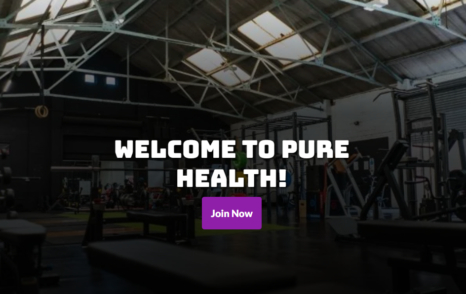

#### Footer

- The footer appears on all pages on the site.

- The footer contains links to the gym's social media pages which can be opened on a new tab.

- The footer has general contact information such as the gym's email and phone number.

- The logo's of the social media links have a hovering effect to show that they can be pressed on.

- The footer is responsive on different devices.

- Contact information has a anchor link.

 Footer Screenshot 

**Mobile**  

**Tablet**  

**Desktop**  

#### **Favicon**

- Every page on my site has a favicon. The favicon logo shows up on the tab at the top. This is used to represent a website and it can be helpful for a user that has lots of tabs open in their browser.

 Screenshot 

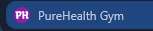

 

### Home page

#### **Hero section**

- When the user first opens the homepage of the website they will see the hero section with a image of the gym. The image has a heading of "Welcome to Pure Health!" which greats the user to the gym website.

- The hero image is responsive on different devices with different image sizes.

- Underneath the hero text there is a "join Now" button. The button is made with CSS and has a hover effect when the user puts their cursor on the element.

- The Join Now button sends the user to the gym's membership page.

Screenshot 

### Hero ###

### Join Now button hover ###
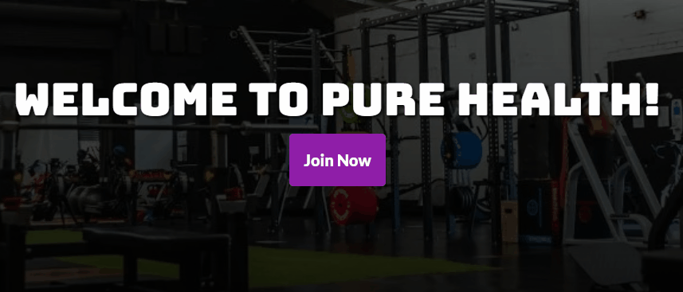
           

#### **What we offer section**

- After the hero section, there is a next section on what the gym offers. The section contains 4 cards with a title and paragraph.

- Each card is fully responsive and resizes on which device you are on. Mobile has one column throughout the page, tablet has two columns and desktop has 2 or 4 columns.

- The cards have a border that has a linear gradient making it look better visually.

- Each card containes a image at the top with a svg design for the background of the rest of the card.

- This shows users when they visit the website the benefits of what we offer.

- Each card has a button that links to other pages of the website with hover effect. The button get's larger when hovering over them.

- Each button has a active effect which when clicking on the background colour of the button will be a darker shade.

- Screens 1400px and above will have a hover transition effect on the cards making them scale 1.1 larger when the cursor is on it. The cards will ease back to its normal size when the cursor moves away from it.

 Screenshots 

### Card button hover effect ###
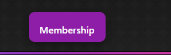 

This button is on every card on the offer section. It gets slightly bigger when hovering over the element and turns a darker shade.

### Mobile screenshots ###

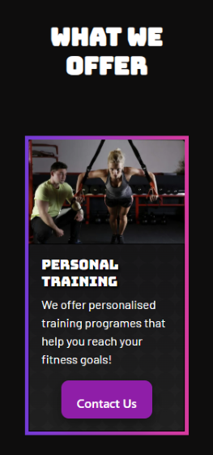 

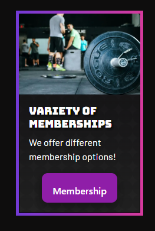 

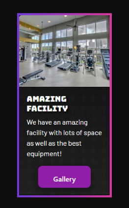 

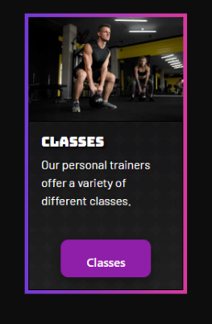

### Tablet screenshots ###

### Desktop screenshots ###

### Desktop hover effect ###

#### **Location Section**

- Shows a embeded map from google maps of the location of the gym to help users find the gym.

- The map is responsive on different devices.

- Linked to the navbar so that if the user is on a different page they can click on it to send them to the hompage location section.

#### **Opening and closing times**

- Shows the user what days and times the gym is open.

- The table adapts to what screen size you are on.

 Screenshots 

### Location - Desktop ###
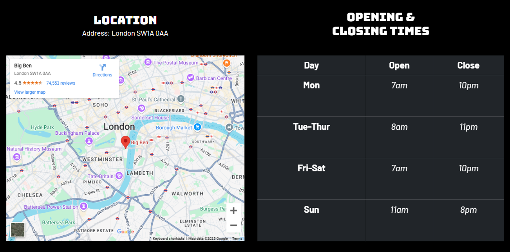 

### Location Tablet ###

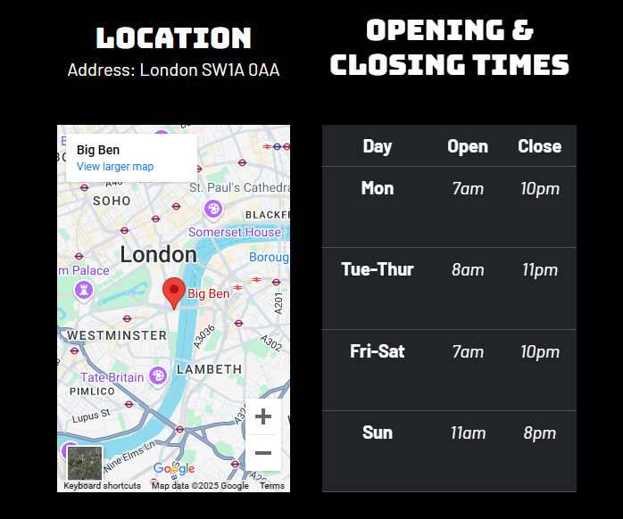 

### Location Mobile ###

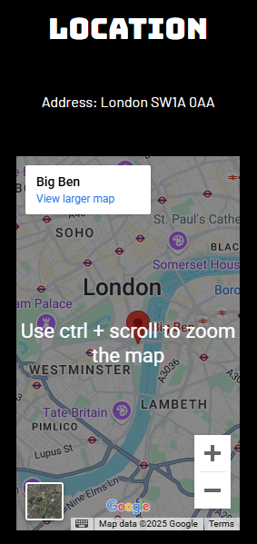

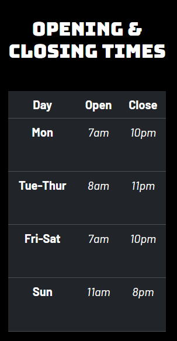

 

### **Membership page**

- Information of the membership types with 4 options.

- Each membership option has a join now button which has the same design throughout the website.

- Each card contains a SVG image in the background to give it texture.

- Responsive on all devices.

- Includes FontAwesome icons to make it look better visually.

- Responsive on different screen size. Mobile users will have the classes cards in one column and four rows. Tablets and computers will have two columns and 2 rows.

 Screenshots 

### Hero image ###

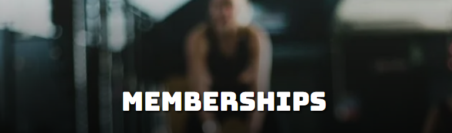

### Membership Mobile ###

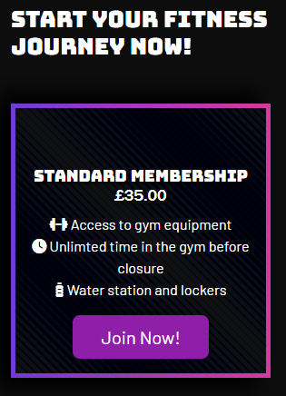 

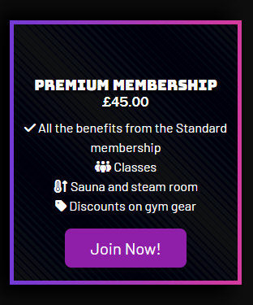 

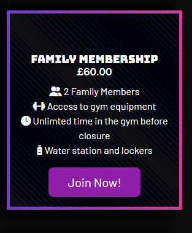 

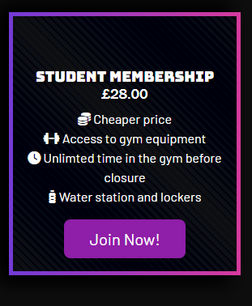 

 ### Membership Tablet ### 

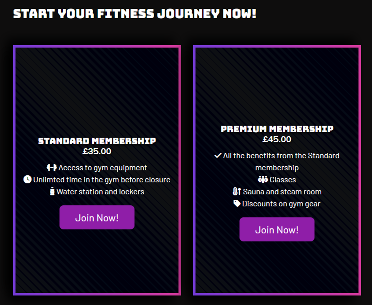 

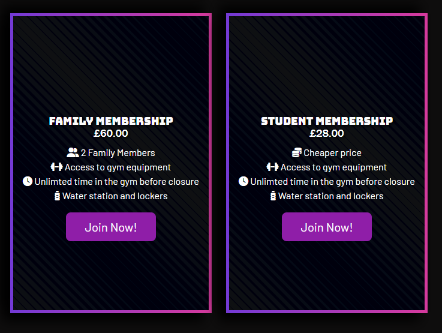 

### Membership Desktop ###

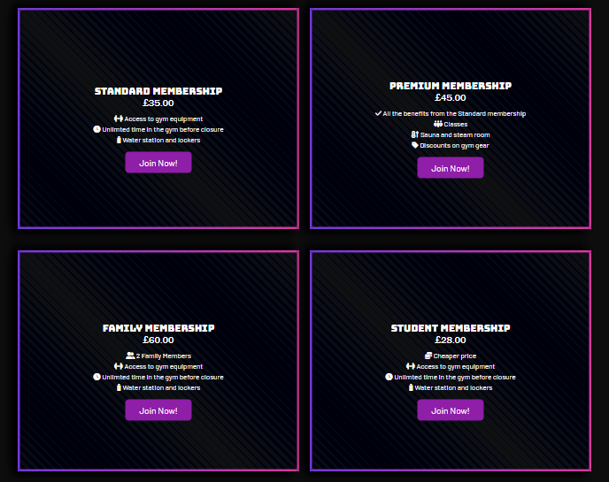 

 

### **Contact page**

- Form that users can send messages to the gym to enquire.

- Similar button styles found throughout the website.

- Includes a success page so the user knows that their form has been sent.

- Emails and phonenumber are linked.

- The elements that are part of the form are required to be completed before the user can submit.

   

 Screenshots 

### Hero image ###
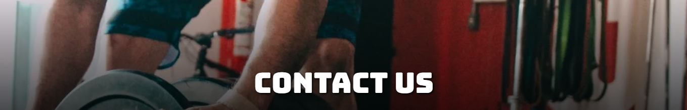

### Mobile ###
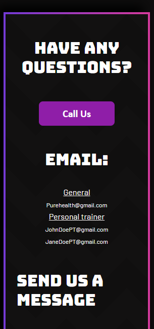

 ### Contact page - Tablet ###

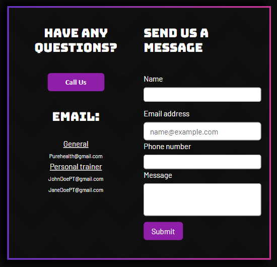

 ### Contact page - Desktop ###

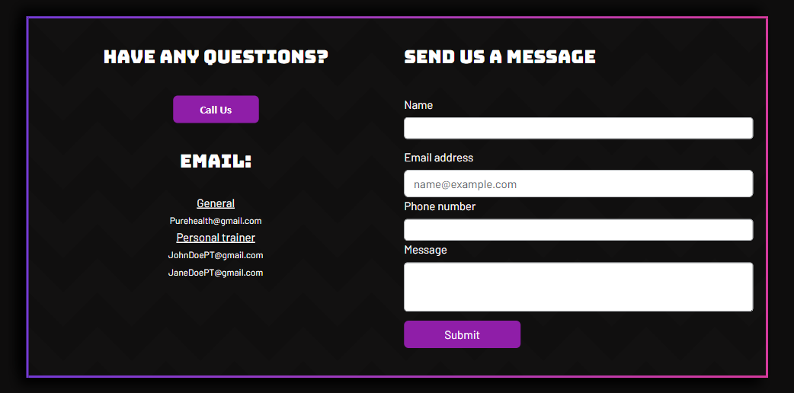

### **Gallery page**

- Has a image carousel that the user can control with on screen arrow keys.

- Carousel switches images on it's own.

- This page will give the user the option to view images of the gym and people training in the gym.

- Video is included in the carousel and is responsive.

- image sizes are responsive. 

 Screenshots 

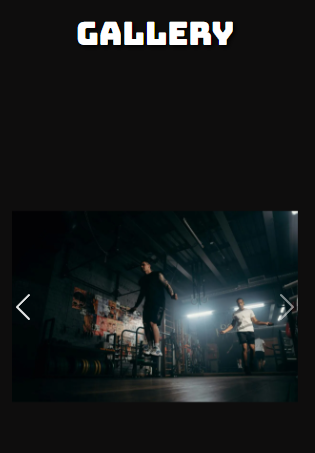
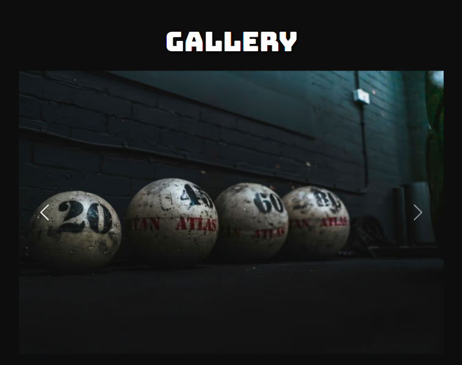

### **Classes page**

- As a similar layout to the membership page to give the user familiarity when navigating around the website. 

- Shows the user information on what classes the gym offers and the days they are on.

- Includes icons from fontawesome.

- Responsive on different screen size. Mobile users will have the classes cards in one column and four rows. Tablets and computers will have two columns and 2 rows.

 Screenshot 

### Hero ###
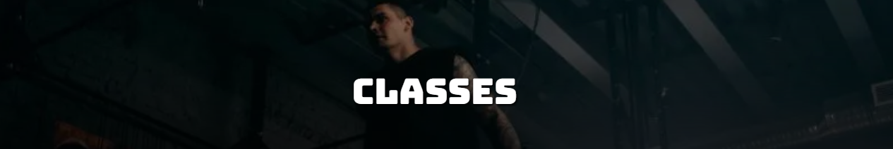

### Classes page - mobile ###

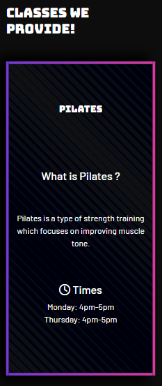
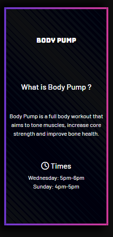

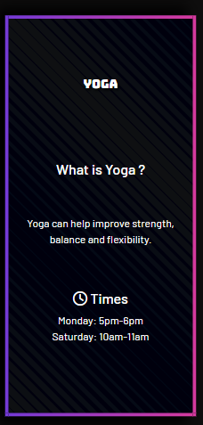

 ### Classes page - Tablet ###
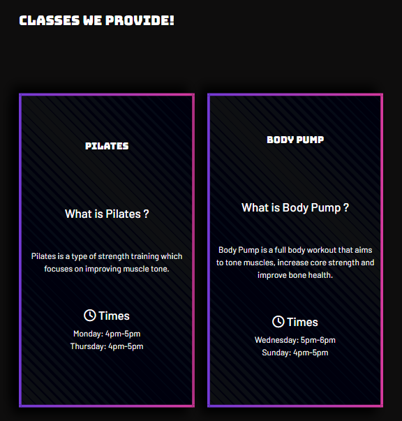 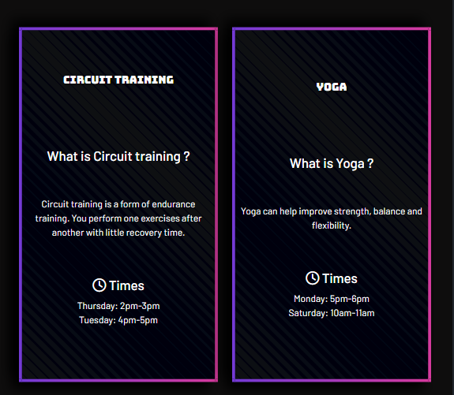

### Classes page - Desktop ### 
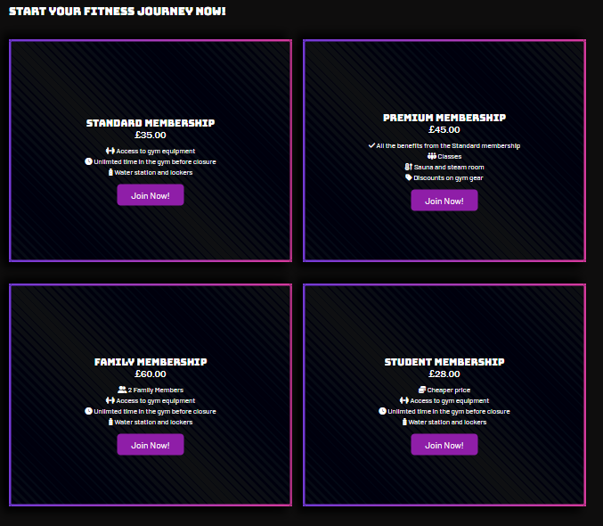

### **Other pages**

#### **Success page**

- Page can be only accessed through the contact page submission form.

- Helps the user know the form has been sent through successfully.

- Includes the footer and navbar so that the user can navigate to a different page.

- Has a button in the middle of the page that sends the user to the homepage when pressed on.

 Screenshot 

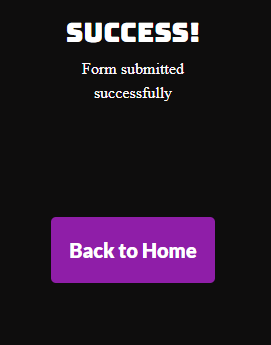

#### 404 page  ####

- This page appears when a user types in a page that doesn't exist.

- Includes footer and navigation so the user can navigate to different pages.

- Has a button under the 404 message like the one on the success page that sends the user to the home page.

- Can reduce the bounce rate of viewers visiting the site.

 Screenshot 

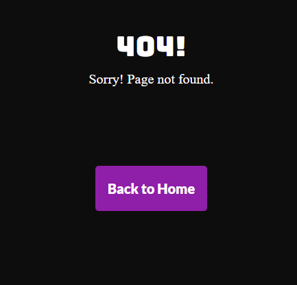

### Future features

- I want to make 4k more responsive on my website.

- Online classes.

- Member portal

## 5. Testing & Bugs

### HTML validation

To test my html code validation I used the [W3C HTML Validator](https://validator.w3.org/)  by direct input. This let's me see what errors I have such as unwanted elements.

 index.html 

Removed the extra div

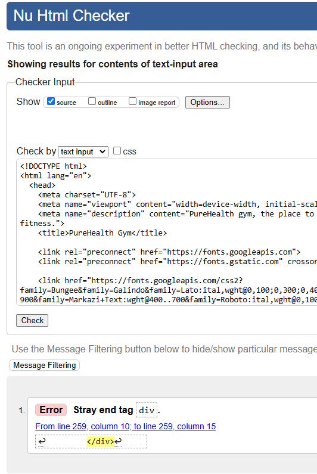

 membership.html 

There were errors on my cards and fixed this by removing the div elements for my prices and removing the h3 from the prices which were making it have a child element. I fixed this by putting the h3 element closing tag before the start of the prices. I also added a h4 to the prices and tested the code again and came back with no errors.

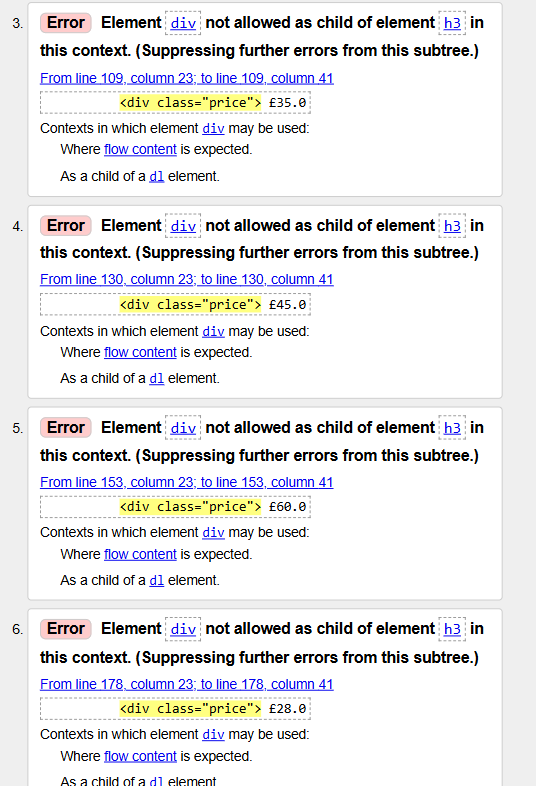

Fix

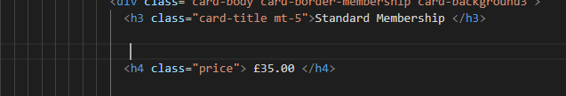

 contact.html 

Couple of minor issues which I removed when testing the contact page in validator.

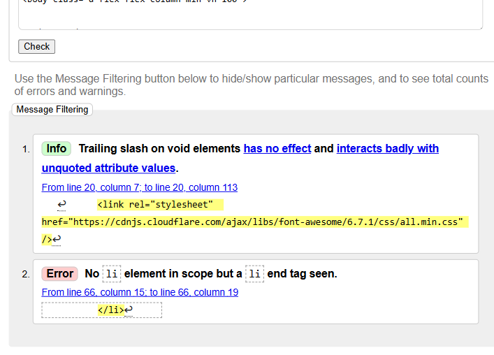

 gallery.html  

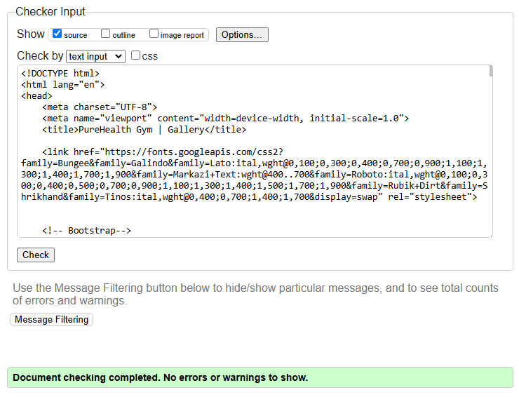

 classes.html  

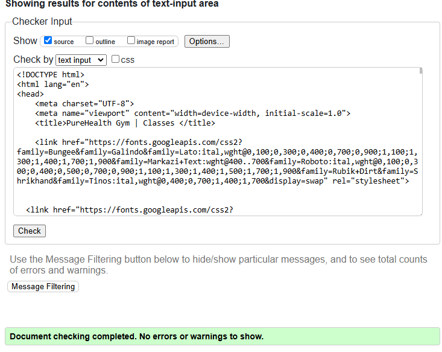

### CSS validation

I copied my style.css code into the [W3C CSS Validator](https://jigsaw.w3.org/css-validator/) and this will show me if I have any coding errors in my css file.

 style.css 

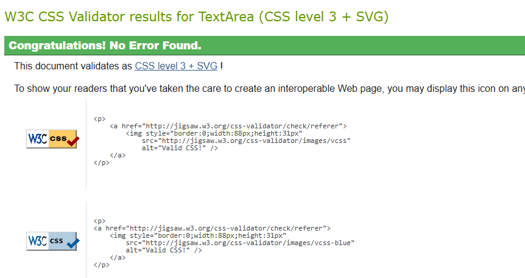

### Accessibility

I used the Wave accessibilty evaluation tool to test if my website is accessible. I picked up some issues when testing the pages.

**incorrect semantic structure**

 Screenshot 

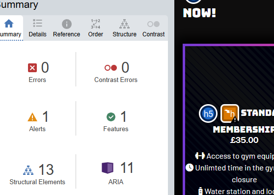

 
I fixed this and changed the h5 on the membership cards to a h3 to make it in the right order.

 

**Unerlined text**

 Screenshot 

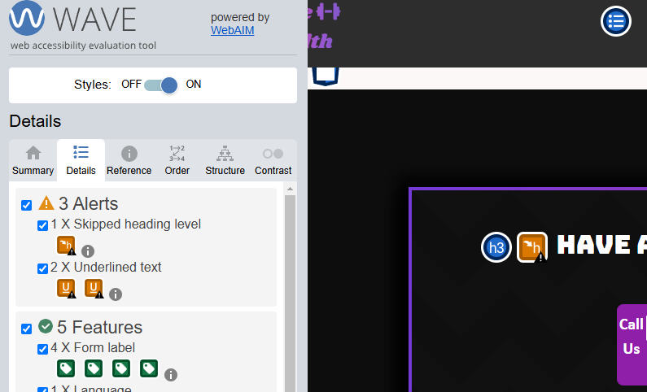

 

This was a error that showed up on the contact page and explained that underlined text indicates linked text. I fixed this by removing the underline in html.
 

**ARIA label**

This error didn't show up on the Wave accessibilty evaluation tool but I seen an error on my ARIA label tags for my "Call Us" button on the membership page which has the wrong text in it and was the same ARIA label as the "Join Now" hero button. I fixed this by going into html contact page and changed it to match the action of the button.

**Contrast** 

I had some contrast errors with the purple on the buttons. I fixed this by changing the purple colour to a slightly darker shade of purple.

### Performance using Lighthouse

I used lighthouse to test my website performance throughout the project. Lighthouse enables me to get reports back on suggestions for improvements. This enables me to make the website load faster on mobile and desktop.

**Results** 

 Mobile 

### Membership ### 
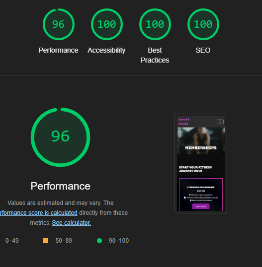

Added a preload to the hero image to make it load faster.

### Contact ### 
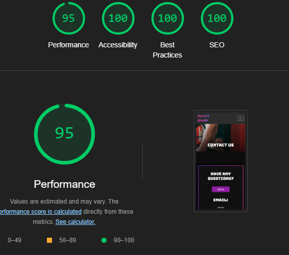

### Gallery ###
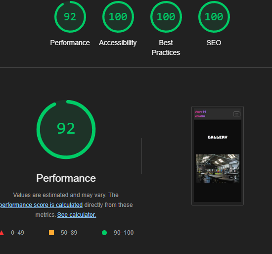

### Classes ###
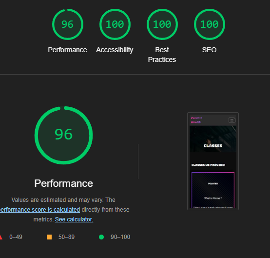

 Desktop 

### Home ###
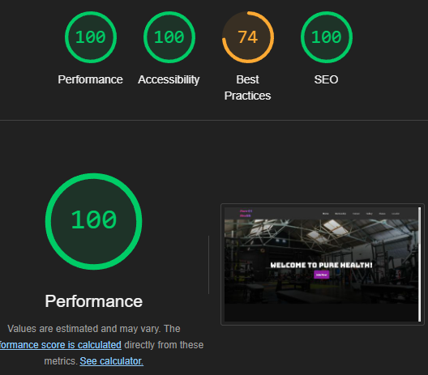

The best practises issues came from google maps that I embed from. I couldn't really change this without removing the map because the issue is third-party cookies.

### Membership ### 

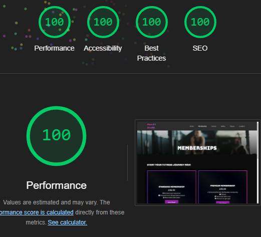

### Contact ### 

### Gallery ###

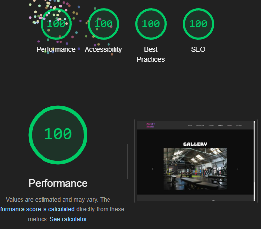

### Classes ### 

### Testing on different devices

### Bugs during development and fixes

**Hero text**

When adding my hero text it would blend into the background image therefore making it hard to see. To fix this I looked at the batala_bangor website that was sent to me by a mentor for a example of a project. I seen that they too used a white text for the hero image and seen how they used a linear gradient to make their text stand out from the image. I searched online to see how I could implement this code and came across w3schools.com. On the website I found the linear gradient on CSS functions. This fixed the white text that was blending into the background.

**Card size on different devices**

Noticed on chrome dev tools that when changing the screen sizes, the cards border would get wider but the card didn't. I first tried changing it in CSS but then went to the index.html page and changed the col size to a lower number on large screens.

**Card layout on screens 1400px and above**

I wanted the cards on the What we offer section to all fit on the same row but the fourth one would go underneath. I looked at my code and changed both the cards on the left and right side and made them col-xxl-2 instead of 3 which made all cards stay on the same row.

**Images causing bad performance**

I was struggling with website performance with my images for a while. I spoke to student mentor and found out the images where to big and the wrong image format. I fixed this my resizing the images for different device breakpoints and converted them to a Webp file.

### Testing User Stories

## Deployment

### Github

## Credits

Hero image linear Gradient to make my text stand out from the image - https://emmahewson.github.io/mp1_batala_bangor/

Navbar - https://getbootstrap.com/docs/5.3/components/navbar/#how-it-works 

Images - https://pixabay.com/  https://pixabay.com/users/lewisgoodphotos-15859574/

Membership hero image - https://unsplash.com/@yellowteapot

Home hero image - https://unsplash.com/@samuelgirven

Contact hero image - https://unsplash.com/@victorfreitas

Classes hero image - https://www.pexels.com/@cottonbro/

Offer section images - https://www.pexels.com/@pixabay/ https://unsplash.com/@victorfreitas https://pixabay.com/users/lewisgoodphotos-15859574/ https://pixabay.com/users/energiefitness-24268442/

text-shadow h1 - https://www.w3schools.com/cssref/css3_pr_text-shadow.php

SVG designs - https://www.svgbackgrounds.com/set/free-svg-backgrounds-and-patterns/ Free SVG Backgrounds and Patterns by SVGBackgrounds.com

Video - https://www.freepik.com/

## Acknowledgements

- Student mentor Gareth McGirr in helping me throughout the project.

- Code Institute.

